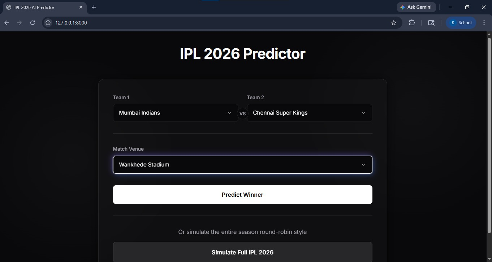
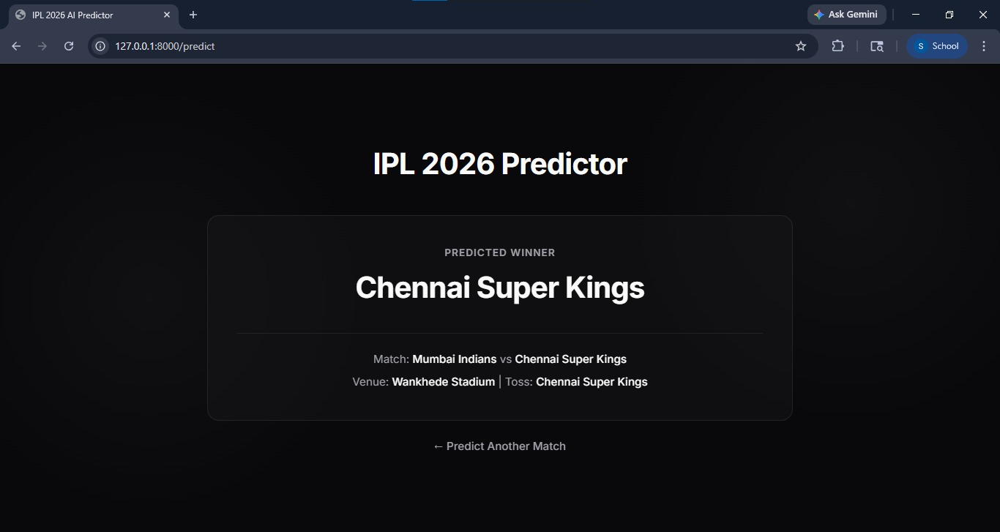
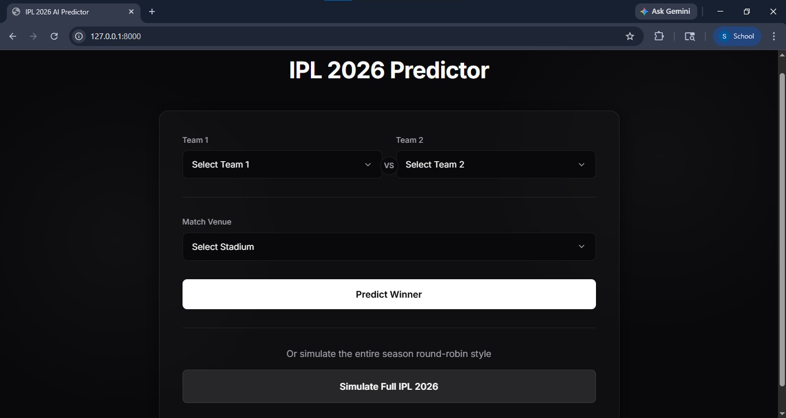
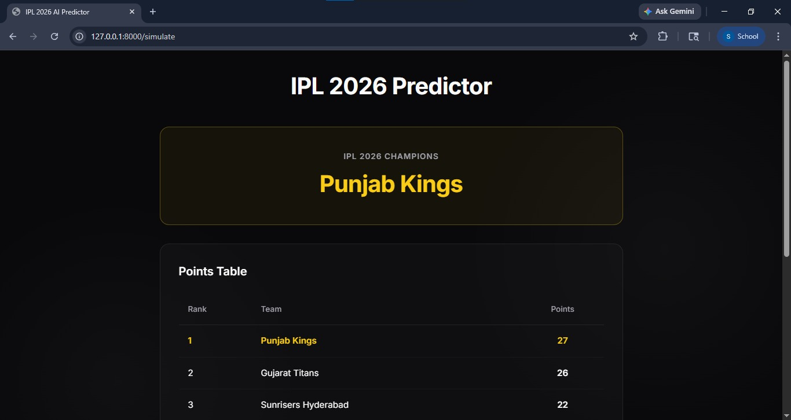

#  IPL 2026 Match Predictor
## Screenshots

A Machine Learning + FastAPI project that predicts IPL match winners and simulates tournament outcomes.

## Features
- Match winner prediction
- FastAPI backend
- Clean ML pipeline
- Realistic data generation

## Tech Stack
- Python
- FastAPI
- Scikit-learn
- Pandas

## API Endpoints

POST /predict_api

Example request:
{
  "team1": "MI",
  "team2": "CSK"
}

Response:
{
  "winner": "MI"
}

## Setup

pip install -r requirements.txt

# Generate dataset
python generate_realistic_data.py

# Train model
python train.py

# Run server
python run.py
